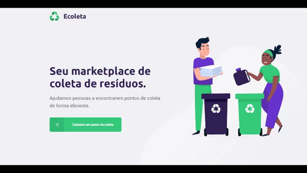

<h3 align="center">
    
    <br>
</h3>
<p align="center"> <strong>Ecoleta:</strong> Aplicação desenvolvida na 1ª Next Level Week da Rocketseat.
 </p>


# Índice

- [Sobre](#sobre)
- [Tecnologias Utilizadas](#tecnologias-utilizadas)
- [Como Usar](#como-usar)
- [Como Contribuir](#como-contribuir)

<a id="sobre"></a>

## Sobre

O <strong>Ecoleta</strong> é uma aplicação Web e Mobile para ajudar pessoas a encontrarem pontos de coleta para reciclagem em sua cidade ou região.

##  Tecnologias Utilizadas

O projeto foi desenvolvido utilizando as seguintes tecnologias

- [TypeScript](https://www.typescriptlang.org/)
- [Knex](http://knexjs.org/)
- [Node.js](https://nodejs.org/en/)
- [ReactJS](https://reactjs.org/)
- [React Native](https://reactnative.dev/)

##  Resultado:

<h3 align="center">


</h3>

<a id="como-usar"></a>

##  Como utilizar


###  Instalação - Back-End (Servidor/API)
Clone o projeto em seu computador. Para instalar as dependências e executar o **Servidor** (modo desenvolvimento) execute:
```bash
cd server
yarn install // npm install
yarn dev // npm dev
```

###  Instalação - Front-End (Aplicação Web)
Para iniciar o **Frontend** do React utilize os comandos:
```bash
cd web
yarn install // npm install
yarn start // npm start
```
Assim que o processo terminar, automaticamente será aberta no seu navegador a página `localhost:3000` contendo o Projeto desenvolvido no dia 3 de 5.

###  Mobile

Para ver a aplicação mobile com o React Native, primeiro é necessário colocar o IP do seu servidor (ou computador) no arquivo `src/services/api.js`, e depois executar os comandos:
```bash
# NÃO é preciso executar a linha de baixo caso ja tenha o Expo (CLI) instalado
yarn global add install expo-cli // npm install -g expo-cli
cd mobile
yarn install // npm install
yarn start // npm start
```

Assim que o processo terminar, automaticamente será aberta no seu navegador a página `localhost:19002`. Conecte seu emulador, ou teste o aplicativo por `LAN`: baixe o aplicativo *Expo* da Play Store ou App Store e em seguida escaneie o código QR.


